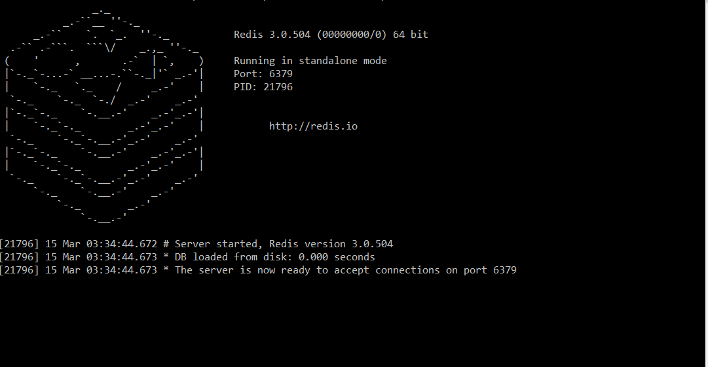

# Redis with Sample ASP.Net Core Web Api Application

This sample application shows how to use redis cache in .Net Core Web Api Project.

## Installation(Windows)

Download the stable release from [here](https://github.com/MicrosoftArchive/redis/releases).

Run redis-server.exe

